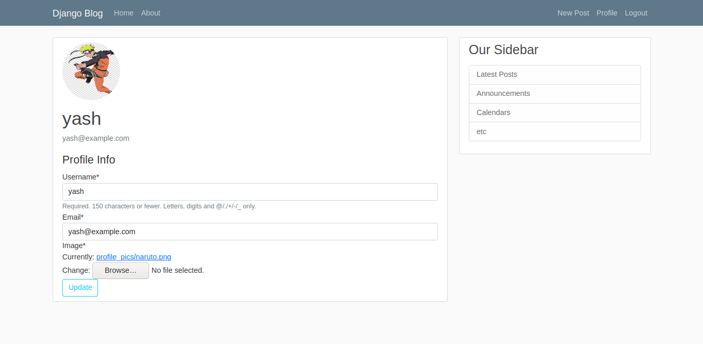

# A simple blogging website in django

My django project consisting of multiple essential web apps like users, profiles, login, logout, blog posting, and so on!
Below I show you screenshots of multiple views of it

## Home page:
This is the home page or main page where you could see all the posts by different users

## Login page:
This is the login-page, with a fully functional form.

## Register page:
As the name suggests, this is the register page, with password checks, username checks and all the required. After registering properly, you can login as it directly routes you to the login page

## Login view:
After logging in, a few things have changed. You can notice the navigation buttons now say Profile and Logout, indicating you're now logged in and can use the feautres as you like

## New Post
You can create a new post by click on the new-post button on the home page

## Profile page
Your profile page is your account details, which is also editable instantly, with the profile photo as well.

## Logout page
You can logout successfully

# Mainly, the admin panel for the managers of the website
This is the django-admin interface, an user with correct privileges can modify alot of things. delete posts, delete users, change post info etc. Powerful!

